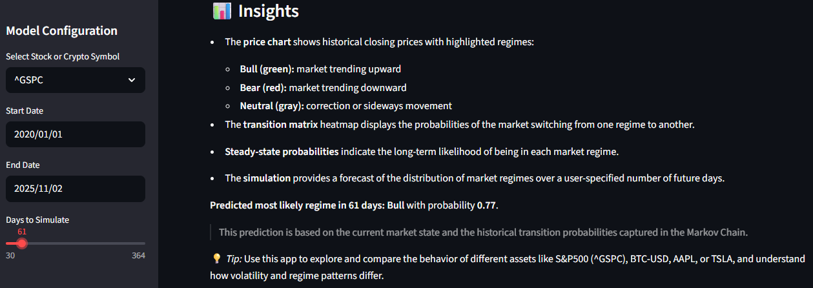

# Market Regime Markov Model

[Live App Link](https://marketmarkovmodeljaheemedwards.streamlit.app/)

---

## 📌 Overview

The **Market Regime Markov Model** is a Streamlit web app that analyzes historical stock and cryptocurrency prices to identify market regimes and model their transitions using a Markov Chain. The app allows users to visualize price movements, regime classification, transition probabilities, steady-state probabilities, and simulated future market states. Users can also optionally overlay the S&P 500 for comparison.

---

## 🧠 Theory & Concepts

### Market Regimes

Financial markets can switch between different **regimes**:

* **Bull Market:** Prices trending upward over a sustained period.
* **Bear Market:** Prices have fallen 20% or more from recent highs over at least two months, typically with pessimism and economic contraction.
* **Neutral / Correction:** Prices have declined 10%–20% or are relatively stable, representing corrections or sideways movement.

Understanding regimes helps investors adjust strategies, forecast likely transitions, and assess long-term tendencies.

### Markov Chains in Finance

A **Markov Chain** is a stochastic process where the **next state depends only on the current state**:

* **States:** Bull, Bear, Neutral/Correction
* **Transition Matrix:** Probability of moving from one state to another
* **Steady-State Probabilities:** Long-term probabilities of being in each state

The app models daily market regimes as a Markov Chain to predict future states and understand long-term market tendencies.

### Key Components

| Concept             | Theory                             | Implementation                           | Purpose                                        |
| ------------------- | ---------------------------------- | ---------------------------------------- | ---------------------------------------------- |
| Market Regimes      | Bull/Bear/Neutral states           | Drawdown-based `get_market_state()`      | Discretize returns for Markov modeling         |
| Markov Chain        | Next state depends only on current | Transition matrix computation            | Model probabilities of regime changes          |
| Steady-State        | Long-run probabilities             | Eigenvector method                       | Identify long-term tendencies                  |
| Simulation          | Forecast future regimes            | `np.random.choice` with transition probs | Scenario analysis                              |
| Interactive Visuals | Communicate insights               | Plotly charts                            | Help users interpret regimes and probabilities |
| Comparative Analysis| Overlay other indices              | Optional S&P 500 line                     | Compare performance across assets             |

---

## ⚙️ Implementation

1. **Data Selection:** Users choose from a predefined list of stocks, cryptocurrencies, or the S&P 500 (`^GSPC`) via a dropdown menu.
2. **Data Download:** Historical price data is fetched from Yahoo Finance.
3. **Drawdown & Return Calculation:** Daily returns and rolling drawdowns are computed to classify market regimes.
4. **Market Regime Classification:** Each day is categorized into Bull, Bear, or Neutral/Correction based on drawdowns.
5. **Smoothed Shading Plot:** Background is shaded by regime with a prominent line showing closing prices.
6. **Two-Panel View:** Upper panel shows prices; lower panel shows stepwise regime level with dynamic color (green/red/gray) depending on the regime.
7. **Regime Heatmap:** Heatmap of regime over time for easy visualization.
8. **Transition Matrix:** Counts and normalizes transitions between regimes to form a probability matrix.
9. **Steady-State Probabilities:** Eigenvector method identifies long-term likelihood of being in each regime.
10. **Simulation:** Generates possible future regimes using the transition probabilities.
11. **Interactive Visualization:** All charts are interactive with hover info and color-coded regimes.

---

## 🖥️ How the App Looks

* **Price Chart:** Closing prices with colored segments for Bull (green), Bear (red), and Neutral/Correction (gray) regimes.
* **Smoothed Shaded Plot:** Background shading by regime with a prominent price line for clarity.
* **Two-Panel View:** Step line shows regime levels with colors corresponding to the current market state.
* **Regime Heatmap:** Visual overview of regime transitions over time.
* **Transition Matrix:** Heatmap showing probabilities of switching from one regime to another.
* **Steady-State Probabilities:** Bar chart showing long-term regime probabilities.
* **Simulation:** Bar chart showing distribution of simulated future market regimes.
* **Sidebar:** Controls to select ticker, date range, number of days for simulation, and optional S&P 500 overlay.




---

## 🔗 Live Website

Explore the app live: [Market Regime Markov Model](https://marketmarkovmodeljaheemedwards.streamlit.app/)

---

## 💻 How to Run Locally

1. **Clone the repository**:

```bash
git clone https://github.com/your-username/market-regime-markov-model.git
cd market-regime-markov-model
````

2. **Create a virtual environment (optional but recommended)**:

```bash
python -m venv venv
source venv/bin/activate       # Linux/macOS
venv\Scripts\activate          # Windows
```

3. **Install dependencies**:

```bash
pip install -r requirements.txt
```

Make sure your `requirements.txt` includes:

```
streamlit
pandas
numpy
yfinance
plotly
```

4. **Run the app**:

```bash
streamlit run app.py
```

5. Open the URL provided in the terminal (usually `http://localhost:8501`) to interact with the app.

---

## 📝 Notes

* The app uses **drawdown-based thresholds** for regime classification:

  * Bear Market: drawdown ≤ -20%
  * Neutral/Correction: drawdown between -10% and -20%
  * Bull Market: drawdown > -10%
* Smoothed shading plots now include a **thick line** for closing prices to ensure visibility.
* Two-panel step plots dynamically color the step line according to regime for clarity.
* Users can include the **S&P 500** as a comparison to see relative performance.
* All visualizations are interactive and rendered using Plotly.
---